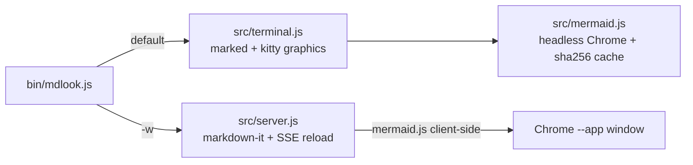

# mdlook

Markdown previews with **real mermaid diagrams** — inline in your terminal, or in a
standalone popup window with live reload.

```sh
mdlook README.md         # rich render in the terminal, diagrams as actual images
mdlookw README.md        # chromeless popup window, live-reloads on save
cat notes.md | mdlook -  # stdin
```


**Follows your terminal theme** — same file, light theme, no flags:


**Popup mode** (`mdlookw`) with the dark-mode toggle:


## Why

Terminal markdown viewers don't render mermaid (glow's most-requested features are
inline images and mermaid support). Browser previewers don't live in your terminal.
mdlook does both, with one tiny CLI:

- **Terminal mode**: GitHub-flavored rendering with distinct heading levels, shaded
  code panels (theme-aware — it asks your terminal for its background color), colored
  lists, task-list checkboxes, emoji shortcodes — and mermaid diagrams rendered to
  PNG and displayed inline via the Kitty graphics protocol.
- **Popup mode**: a chromeless app window (plain Chrome `--app`, no Electron) with
  GitHub styling, client-side mermaid, syntax highlighting, a dark-mode toggle, and
  live reload that survives editors' atomic saves.
- **GitHub extras in both modes**: alerts (`> [!NOTE]`, `[!TIP]`, `[!WARNING]`, ...)
  with proper colors and titles; YAML frontmatter is recognized and tucked away
  (collapsible in the popup) instead of rendering as garbage.

Everything renders locally — no CDN, no external services; your documents never
leave your machine.

## Install

```sh
npm install -g mdlook
```

Requirements:

- Node ≥ 22
- Google Chrome or Chromium (used headlessly for diagram rendering and for the popup
  window). Auto-discovered on macOS/Linux/Windows; override with `CHROME_PATH`.

Without Chrome, terminal mode still works — mermaid blocks fall back to plain fences.

## Terminal support for inline images

Diagrams render inline in terminals that speak the Kitty graphics protocol:
**Kitty, Ghostty, WezTerm, Konsole**. Other terminals (iTerm2, VS Code, Terminal.app,
Windows Terminal) automatically fall back to showing the diagram source — no garbage,
no missing content. Inside tmux, images are disabled.

## Usage

| Command / flag      | What it does                                               |
|---------------------|------------------------------------------------------------|
| `mdlook FILE.md`    | render in the terminal                                     |
| `mdlookw FILE.md`   | popup window with live reload (same as `mdlook -w`)        |
| `mdlook -`          | read from stdin                                            |
| `--no-images`       | terminal mode: show mermaid/image sources as plain fences  |
| `--refresh`         | re-render mermaid diagrams, ignoring the cache             |
| `--plain`           | minimal styling (GitHub-faithful, no color accents)        |
| `--pager` / `--no-pager` | force / suppress paging; long docs auto-page when images are off |
| `--port N`          | fixed port for popup mode (default: random)                |

Environment: `CHROME_PATH` points at a Chrome/Chromium binary; `MDLOOK_NO_OPEN=1`
starts the popup server without opening a window.

## How it works



- Mermaid PNGs are rendered by **one shared headless Chrome** (via puppeteer-core
  driving your system browser — no bundled Chromium download) and cached at
  `~/.cache/mdlook/mermaid/` by content hash, so repeat previews are instant. Broken
  diagrams are negative-cached so they fail fast; theme is part of the cache key.
- The popup is plain Chrome launched with `--app=` and a dedicated profile; closing
  the window shuts the server down within a few seconds.
- Live reload watches the file's directory (not the file), so atomic saves from
  VS Code/IntelliJ don't kill the watcher; the page swaps content over SSE and
  preserves your scroll position.
- Dark mode: terminal diagrams and code panels follow your terminal's detected
  background; the popup follows the OS, with a manual toggle persisted across runs.

## Contributing

See [CONTRIBUTING.md](./CONTRIBUTING.md) — dev setup, tests (`npm test`), lint
(`npm run lint`), and project conventions.

## Releasing (maintainers)

```sh
npm version patch        # or minor / major — bumps package.json and creates a git tag
git push --follow-tags   # push the commit and the tag
npm publish              # requires npm 2FA
```

`npm version` follows [semver](https://semver.org/): `patch` for fixes, `minor` for new
features, `major` for breaking changes. Update [CHANGELOG.md](./CHANGELOG.md) before
tagging.

## License

MIT
