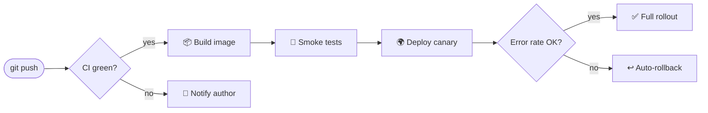

# 🚀 Orbit — deployment pipeline

A tiny service that ships your code from **commit** to *production* with one command: `orbit ship`.

> [!TIP]
> Preview this file with `mdlook demo/showcase.md` — the diagram below renders as a real image, right here in your terminal.

## How it works



## Quick start

```python
from orbit import Pipeline

pipeline = Pipeline("my-service")
pipeline.deploy(strategy="canary", traffic_step=0.10)
print(f"Shipped {pipeline.version} 🎉")
```

## Release checklist

- [x] Tests passing on `main`
- [x] Changelog updated
- [ ] Canary metrics reviewed
- [ ] Announce in **#releases**

## Environments

| Environment | Region       | Strategy   | SLA     |
|-------------|--------------|------------|---------|
| `dev`       | eu-west-2    | rolling    | none    |
| `staging`   | eu-west-2    | blue/green | 99.5%   |
| `prod`      | multi-region | canary     | 99.95%  |

> [!WARNING]
> Rollbacks restore the previous **image**, not the previous *database schema*. Plan migrations accordingly.

> "Ship small, ship often, sleep well." — every SRE, eventually

---

Made with ☕ and `mdlook` :sparkles:
