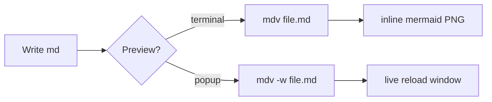

# mdv test fixture :rocket:

A paragraph with **bold**, *italic*, `inline code`, a [link](https://example.com), and emoji shortcodes :tada: :white_check_mark:.

> A blockquote with some wisdom.
> Second line of the quote.

## Code block

```python
def greet(name: str) -> str:
    """Say hello."""
    return f"Hello, {name}!"
```

## Table

| Tier       | Role                  | Focus        |
|------------|-----------------------|--------------|
| Artisan    | Senior engineer       | Craft        |
| Catalyst   | Feature owner         | Ownership    |
| Multiplier | Engineering leader    | Leverage     |

## Mermaid diagram



## Broken mermaid

```mermaid
flowchart LR
    A --> ===> nonsense here
```

## Nested list

1. First
   - sub item :bulb:
   - another sub
2. Second

Done.